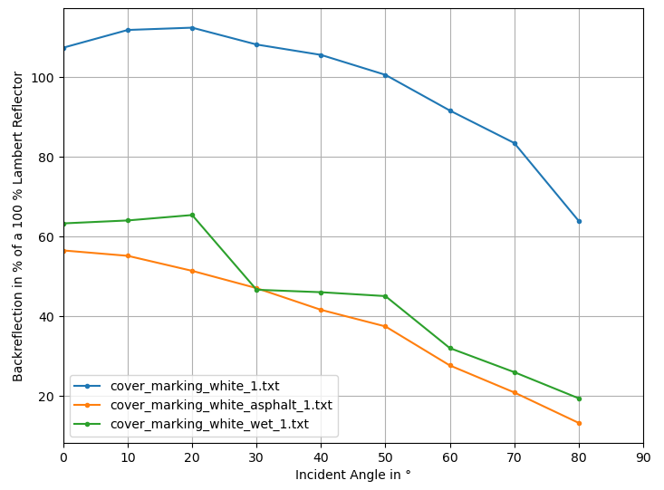

# Spectral-Reflectance-Data-Plotter
Jupyter Notebook to plot data from the [Virtual Vehicle Spectral Reflectance Database](https://zenodo.org/record/7467552#.ZBIFb9LMJhE).

You can select multiple reflectance measurements and display them in one plot in a Jupyter Notebook.
Here is an example plot:

You can find the data and more information about it here:

David J. Ritter, Relindis Rott, Birgit Schlager, Stefan Muckenhuber, Simon Genser, Martin Kirchengast, Marcus Hennecke:
*Angle-dependent spectral reflectance material dataset based on 945 nm time-of-flight camera measurements*,
Data in Brief,
2023,
https://doi.org/10.1016/j.dib.2023.109031.

